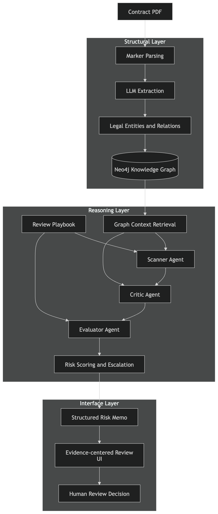

# ContractSentinel

**Agentic Legal Risk Review System for Contract Escalation**

ContractSentinel is a LegalTech AI system that models contract review as a policy-driven reasoning workflow rather than a simple chatbot or summarization tool.

The system parses contracts into a graph-aware legal structure, runs a multi-agent reasoning pipeline, and produces a structured risk memo with evidence chains to support human legal review.

The goal is not to replace lawyers, but to help them identify risk, justify findings, and decide when escalation is required.

---

## System Architecture



ContractSentinel is built around three layers:

- **Structural Layer** – converts contracts into a structured legal graph
- **Reasoning Layer** – performs policy-driven multi-agent review
- **Interface Layer** – presents evidence and escalation recommendations

---

## Overview

Most AI contract tools focus on:

- summarization
- clause extraction
- legal Q&A

However, real contract review involves three harder problems:

### 1. Contracts are not linear

Risk often depends on:

- earlier definitions
- referenced clauses
- exceptions elsewhere in the agreement

**Example:** Section 8.2 – Termination *subject to* Section 4.1 – Limitation of Liability. Understanding this relationship requires cross-clause reasoning.

### 2. Risk is policy-dependent

A clause is risky only relative to:

- market standards
- company legal policy
- client preferences

ContractSentinel therefore evaluates contracts using a **Review Playbook**. Example rules:

- unlimited liability → High risk
- unilateral termination → High risk
- confidentiality > 5 years → Medium risk

### 3. Review is an escalation workflow

In real legal workflows:

- some issues are acceptable
- some require revision
- some require human legal review

ContractSentinel models this escalation process explicitly.

---

## Multi-Agent Reasoning Workflow

The reasoning layer uses LangGraph orchestration with three agents.

### Scanner Agent

Identifies candidate issues using the review playbook.

- **Example detections:** unlimited liability, broad data usage rights, unilateral termination, excessive confidentiality terms
- **Output:** flagged clause, triggered rule, supporting evidence

### Critic Agent

Evaluates whether the Scanner's claim is justified. It checks:

- linked clauses
- definitions
- cross-references
- contextual legal language

This step reduces shallow or unsupported findings.

### Evaluator Agent

Produces the final decision:

- **Acceptable**
- **Suggest Revision**
- **Escalate for Human Review**

**Decision factors:** policy severity, clause ambiguity, cross-clause dependency, evidence confidence.

---

## Example Output

The system generates a **Structured Risk Memo**. Example:

```json
{
  "clause": "The receiving party shall be liable for all damages without limitation.",
  "risk_level": "High",
  "rule_triggered": "Unlimited Liability",
  "reason": "Liability is not capped and may expose the party to unlimited damages.",
  "fallback_language": "Liability shall not exceed the total fees paid under this agreement.",
  "escalation": "Suggest Revision",
  "citation": {
    "section": "Section 7.3",
    "page": 12
  }
}
```

In the UI, each issue is presented as an evidence-based review card containing:

- clause text
- policy rule triggered
- reasoning
- fallback language
- escalation recommendation

---

## Tech Stack

| Area | Technologies |
|------|--------------|
| **Document Parsing** | Marker (PDF parsing), layout-aware text extraction |
| **Knowledge Graph** | Neo4j, LLM entity extraction, clause / definition / reference relationships |
| **Reasoning** | LangGraph orchestration, LLM agents (Scanner / Critic / Evaluator), RAG + graph context retrieval |
| **Backend** | FastAPI, Python |
| **Frontend** | React / Next.js |
| **Evaluation** | Ragas, hand-labeled benchmark dataset |

---

## Evaluation

To validate system behavior, the project includes a small contract review benchmark.

- **Dataset:** NDA contracts, MSA contracts. Annotated with: risky clauses, escalation labels, expected citations.
- **Metrics:** risk clause recall, precision on flagged clauses, cross-reference reasoning success, citation accuracy, escalation accuracy, hallucination rate.
- **Baseline comparison:**

| Method | Description |
|--------|-------------|
| Chunk RAG | traditional chunk retrieval |
| Graph RAG | retrieval with graph context |
| Multi-Agent | scanner + critic + evaluator |

---

## Repository Structure

```
contractsentinel/
│
├── app/
│   ├── api/
│   ├── agents/
│   ├── parsing/
│   ├── extraction/
│   ├── graph/
│   ├── retrieval/
│   ├── evaluation/
│   └── schemas/
│
├── frontend/
│
├── data/
│   ├── sample_contracts/
│   ├── playbooks/
│   └── benchmark/
│
├── notebooks/
├── tests/
└── README.md
```
