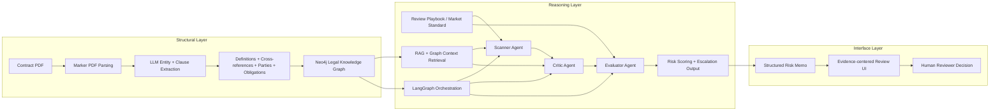

# ContractSentinel

**Agentic Legal Risk Review System for Contract Escalation**

ContractSentinel is a LegalTech AI project that models contract review as a **structured risk analysis and escalation workflow**, rather than a generic chatbot or summarization tool.

The system is designed around a simple product thesis:

> Legal contract review is not just retrieval or question answering. It is a policy-driven reasoning process over structured documents, with explicit evidence and escalation decisions.

In this project, a contract PDF is parsed into a structured representation, enriched into a lightweight legal knowledge graph, analyzed by a multi-agent workflow, and surfaced through an evidence-centered interface for human review.

---

## Project goal

The goal of ContractSentinel is to support review of contracts such as:

* NDA
* MSA

Given a contract PDF, the system produces a **Structured Risk Memo** that includes:

* **risk level**: High / Medium / Low
* **risk rationale**: why the clause is problematic under the review standard
* **fallback language**: a safer alternative or suggested revision
* **escalation decision**:

  * Acceptable
  * Suggest Revision
  * Escalate for Human Review
* **evidence chain**: source clause, cross-referenced clause, and supporting context

This is meant to simulate a realistic legal workflow:

* identify issues,
* justify issues,
* decide whether human escalation is necessary.

---

## Why this project

Most AI contract demos focus on:

* summarization,
* clause extraction,
* or ad hoc legal Q&A.

But real legal review involves three harder problems:

### 1. Contracts are not linear documents

A risky clause often depends on:

* earlier definitions,
* cross-referenced sections,
* limitation language elsewhere in the document.

### 2. Risk is policy-dependent

A clause is not risky in the abstract. It is risky relative to:

* market standard,
* internal review playbook,
* client-specific legal preferences.

### 3. Review is an escalation workflow

Not every issue should be treated the same way.
Some can be accepted, some should be revised, and some require human counsel.

ContractSentinel is built to reflect all three realities.

---

## System architecture

The system has three layers:

1. **Structural Layer**
2. **Reasoning Layer**
3. **Interface Layer**

### Architecture diagram



---

## Layer 1 — Structural Layer

### Purpose

Transform a contract PDF into a machine-usable legal structure.

### Pipeline

* **Marker** parses the PDF into layout-aware text blocks.
* An **LLM extraction step** identifies legal entities and structural components.
* Extracted components are stored in **Neo4j** as a lightweight legal knowledge graph.

### What gets extracted

The system focuses on elements that matter for downstream legal reasoning:

* **Definitions**
* **Clauses / sections**
* **Parties**
* **Obligations**
* **Cross-references** such as `subject to Section 4.2`

### Why this matters

Legal contracts are full of non-local dependencies.
A termination clause may depend on a liability section or a definition introduced pages earlier.

This layer addresses that by turning the contract into a graph-aware structure rather than treating it as flat text.

### Core design idea

> Contracts are not linear. They are dependency networks.

So instead of only chunking text, the system first builds enough structure to preserve legal relationships.

---

## Layer 2 — Reasoning Layer

### Purpose

Run policy-driven legal review over the contract using a staged agent workflow.

### Orchestration

The reasoning workflow is orchestrated with **LangGraph**.

### Inputs

* retrieved clause text,
* graph-linked context,
* review playbook,
* prior agent outputs.

### Components

#### 1. Scanner Agent

The Scanner identifies candidate issues using the review playbook.

Examples:

* unlimited liability,
* unilateral termination rights,
* overly broad data use rights,
* confidentiality period beyond policy threshold.

Its job is to answer:

* which clause looks problematic,
* what policy rule may be violated,
* what evidence should be passed forward.

#### 2. Critic Agent

The Critic does not merely repeat the Scanner’s output.
It tests whether the issue is actually well-supported.

It uses:

* retrieved clause text,
* linked graph context,
* cross-reference resolution,
* definition scope,
* internal consistency checks.

Its job is to answer:

* is the finding legally coherent,
* does the cited clause actually mean what the Scanner claims,
* are there linked clauses that weaken or override the issue,
* is the evidence path sufficient.

This introduces internal skepticism and reduces shallow one-pass conclusions.

#### 3. Evaluator Agent

The Evaluator makes the final workflow decision.

It determines whether the issue is:

* **Acceptable**
* **Suggest Revision**
* **Escalate for Human Review**

This decision depends on:

* policy severity,
* ambiguity,
* clause interaction complexity,
* confidence in the evidence chain.

### Retrieval design

The reasoning layer uses **RAG + graph context**.

Instead of retrieving only a local chunk, the system can also pull:

* linked definitions,
* referenced clauses,
* related obligations,
* surrounding context needed for legal interpretation.

### Core design idea

> Review should be policy-driven, evidence-based, and internally checked before escalation.

---

## Layer 3 — Interface Layer

### Purpose

Present the output in a form that lawyers can inspect, audit, and act on.

### Output artifact

The system generates a **Structured Risk Memo**.

Each issue includes:

* clause citation,
* risk level,
* rationale,
* fallback language,
* escalation recommendation,
* supporting evidence chain.

### UI principles

The interface is not designed as a chat UI.
It is designed as a **review UI**.

The main interaction model is:

* left side: source contract / clause text,
* right side: issue cards,
* each card shows evidence, policy mapping, and escalation logic.

### Why this matters

Legal users need inspectability.
They should be able to see:

* what clause was flagged,
* which policy was triggered,
* which linked clauses were considered,
* why the system recommends escalation.

### Core design idea

> AI provides structured evidence and recommendations; the lawyer makes the final decision.

---

## Evaluation design

To demonstrate that the project is more than a demo, evaluate the system on a small hand-labeled benchmark.

### Benchmark setup

Create a small gold-standard dataset with contracts such as:

* NDA
* MSA

Annotate:

* risk clauses,
* expected escalation labels,
* acceptable fallback language or redline targets,
* supporting citations.

### Suggested evaluation pipeline

* **Hand-labeled dataset** for benchmark truth
* **Ragas** for retrieval / answer quality tracking where appropriate
* custom metrics for legal review quality

### Metrics

* **risk clause recall**
* **precision on flagged issues**
* **cross-reference reasoning success**
* **citation accuracy**
* **escalation accuracy**
* **hallucination rate / unsupported claims**

### Baseline comparison

Compare:

1. plain chunk-based RAG
2. RAG with graph context and multi-agent reasoning

This helps show whether graph-aware structure and agent critique materially improve review quality.

---

## Tech stack

### Data ingestion / structure

* **Marker** for PDF parsing
* **LLM** for legal entity and relation extraction
* **Neo4j** for legal knowledge graph storage

### Reasoning

* **LangGraph** for orchestration
* **LLM API** for Scanner / Critic / Evaluator agents
* **RAG pipeline** for clause retrieval plus graph-linked evidence expansion

### Evaluation

* **Hand-labeled gold dataset**
* **Ragas** for metric tracking

### Product layer

* **FastAPI** for backend services
* **React / Next.js** for review UI

---

## What makes this project compelling

This project is not just a GraphRAG demo.

Its value is that it combines:

* **structured legal document understanding**,
* **graph-aware retrieval**,
* **multi-agent reasoning with internal critique**,
* **policy-driven escalation logic**,
* **human-centered evidence presentation**.

That makes it closer to a realistic LegalTech review system than a generic LLM application.

---

## Example interview pitch

> Most contract AI systems focus on summarization or basic Q&A, but legal review is really a structured decision process. In ContractSentinel, I built a system that first parses contracts into a graph-aware representation of clauses, definitions, and cross-references, then runs a LangGraph-based multi-agent workflow to identify risks, critique those findings, and decide whether escalation is needed under a review playbook. The output is a structured risk memo with evidence chains and escalation recommendations, designed for human legal review rather than autonomous decision-making.

---

## Repository structure

```bash
contractsentinel/
├── app/
│   ├── api/
│   ├── agents/
│   ├── parsing/
│   ├── extraction/
│   ├── graph/
│   ├── retrieval/
│   ├── evaluation/
│   └── schemas/
├── frontend/
├── data/
│   ├── sample_contracts/
│   ├── playbooks/
│   └── benchmark/
├── notebooks/
├── tests/
└── README.md
```

---

## Current Extraction pipeline scope

The current **rule-based clause segmenter** (`app/extraction/clause_segmenter.py`) is tuned for contracts with "Section X.Y" numbering (e.g. the sample `EX-10.4(a).pdf`). PDFs that use other patterns (e.g. "Article 1", "§ 2.1", or no such headings) may get no rule-based clauses; the pipeline still runs and falls back to LLM-only clauses, but quality may vary. The **sample-based flow** (script and `POST /contracts/demo`) is the stable MVP path for the built-in sample contract.

---

## Final takeaway

ContractSentinel treats contract review as a **graph-aware, policy-driven, multi-agent escalation workflow**.

The system is designed around one central belief:

> Good legal AI should not just generate answers. It should expose evidence, apply policy, and know when to escalate.
