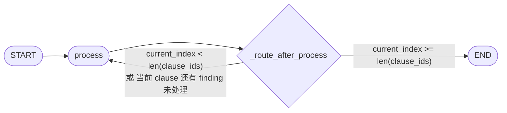
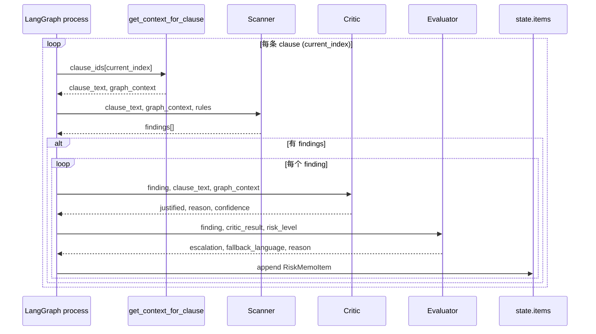

# LangGraph 审查流程图与设计说明

## 图结构（LangGraph 实际拓扑）

当前实现是**单节点 + 条件自环**：只有一个节点 `process`，根据 state 决定下一跳是再进 `process` 还是结束。



- **START**：注入初始 state（contract_id, clause_ids, rules_list, current_index=0, current_ctx=None, items=[] 等）。
- **process**：执行「一步」工作（见下文三种分支）。
- **_route_after_process**：读当前 state，返回 `"process"` 或 `"__end__"`，分别再进 process 或到 END。

---

## process 节点内部逻辑（三种分支）

`process` 每次被调用时，根据 state 落在三种情况之一，只做其中一种事：

```mermaid
flowchart TD
    subgraph process_node [" process 节点内部 "]
        A{current_ctx == None?}
        A -->|是| B[取 clause_ids[current_index]<br>get_context_for_clause]
        B --> C[Scanner]
        C --> D{有 findings?}
        D -->|否| E[current_index += 1<br>保持 current_ctx=None]
        D -->|是| F[写 current_ctx, current_findings<br>current_finding_index=0]
        A -->|否| G{current_finding_index<br>< len(current_findings)?}
        G -->|是| H[Critic]
        H --> I[Evaluator]
        I --> J[append RiskMemoItem 到 items<br>current_finding_index += 1]
        G -->|否| K[current_index += 1<br>current_ctx=None<br>current_findings=[]]
    end
```

| 分支 | 条件 | 动作 |
|------|------|------|
| **1. 加载并扫描** | `current_ctx is None` | 用 `clause_ids[current_index]` 取 context → 跑 **Scanner**；若无 findings 则 `current_index += 1` 并清空 current_ctx；若有则写入 current_ctx、current_findings、current_finding_index=0。 |
| **2. 批评 + 评估** | `current_ctx` 非空 且 还有未处理的 finding | 对 `current_findings[current_finding_index]` 跑 **Critic** → **Evaluator**，拼出 **RiskMemoItem** 并 append 到 state 的 `items`（reducer 用 `operator.add`），然后 `current_finding_index += 1`。 |
| **3. 下一条款** | 当前条款的 findings 都处理完 | `current_index += 1`，`current_ctx = None`，`current_findings = []`，`current_finding_index = 0`，下一轮 process 会进入分支 1 处理下一个 clause。 |

---

## 数据流（按条款的 Scanner → Critic → Evaluator）

逻辑上每条 clause 的流程是：



---

## State 字段说明

| 字段 | 含义 |
|------|------|
| `contract_id` | 合同 ID |
| `clause_ids` | 待审查的 clause id 列表（来自 Neo4j 或调用方） |
| `rules_list` | Playbook 规则（序列化后的 dict 列表） |
| `items` | 已产生的 RiskMemoItem 列表；reducer 为 `operator.add`，节点每次返回 `{"items": [one_item]}` 即追加 |
| `current_index` | 当前处理到第几个 clause |
| `current_ctx` | 当前 clause 的 context（get_context_for_clause 的返回值）；None 表示需要加载下一 clause |
| `current_findings` | 当前 clause 的 Scanner 结果 |
| `current_finding_index` | 当前处理到第几个 finding |

---

## 小结

- **图拓扑**：START → **process** → 条件边（再进 process 或 END）；没有单独的 Scanner/Critic/Evaluator 节点，三者在 **process** 内部按 state 分支调用。
- **循环**：通过「process → _route_after_process → process」实现「逐 clause、逐 finding」的循环，直到 `current_index >= len(clause_ids)` 才到 END。
- **输出**：END 时 state 中的 `items` 即为本次审查的 **StructuredRiskMemo.items**。
